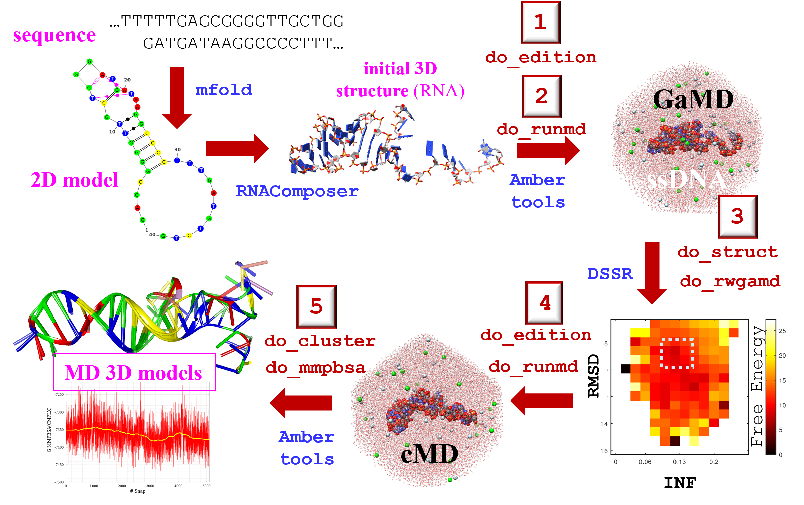

# **APTAMD**

### **Description** 
The application of a computational protocol aimed to refine the 3D structure of aptamer molecules is not straightforward because multiple programs and a large variety of datasets are used. APTAMD is a set of specific scripts that are designed to automate and streamline the most important stages of an MD-based aptamer building protocol that relies on the [AMBER](https://ambermd.org/) suite of programs: (1) building of an initial model starting from a preliminary 3D structure, (2) Gaussian-accelerated MD simulation, (3) structural analysis and construction of a free energy map, (4) conventional MD simulation, and (5) clustering and energy scoring of the MD trajectory of the aptamer. 

The computational protocol implemented in APTAMD is described in detail in the following references:

* A. Díaz-Fernández, R. Miranda-Castro, N. Díaz, D. Suárez, N. de-los-Santos-Álvarez and M.J. Lobo-Castañón. (2020). Aptamers targeting protein-specific glycosylation in tumor biomarkers: general selection, characterization and structural modeling. Chemical Science 11, 9402-9413. [DOI](https://doi.org/10.1039/D0SC00209G )
 
All questions regarding the usage of APTAMD or bug reports should be addressed to Dimas Suárez (dimas@uniovi.es).

### **Installation**

The suite is distributed as collection of scripts for Linux systems. Most of the scripts are written in [BASH](https://www.gnu.org/software/bash/) altough some numerical and plotting tasks are performed using Octave or Python scripts. There are also a few Fortran codes that carry out auxiliary tasks. In a few months, we will replace all the Fortran and Octave codes by Python scripts, but the BASH backbone will be maintained.    

To install APTAMD, download the suite with the commands:

`mkdir APTAMD; cd APTAMD; git clone https://github.com/dimassuarez/aptamd.git`
   
Define the `APTAMD` environmental variable pointing to the directory containing the ATPAMD files:

`export APTAMD=/mydir/APTAMD` 

Compile the auxiliary Fortran codes: 

`cd $APTAMD/AUXTOOLS; ./comp.sh all`

Edit the `$ATPAMD/ENV/aptamd_env.sh` file and adjust the BASH variables pointing to the software tools used by APTAMD. 

Add `$ATPAMD/bin` to your `$PATH` environment variable:

`export PATH=$APTAMD:$PATH` 

**CONTENTS**

The APTAMD collection is organized in the following subdirectories:

* EDITION           : Scripts to prepare coordinate and parameter files 
* RUNMD             : Scripts and files to perform GaMD and MD simulations 
* STRUCT            : Scripts to extract MD frames and/or carry out structural analysis and clustering  
* RWGAMD            : Scripts and files to carry out the energy reweighing of the GaMD trajectories
* MMPBSA            : Scripts to perform MMPBSA-like calculations
* AUXTOOLS          : Scripts and auxiliary Fortran codes.
* ENV               : aptamd_env.sh is located here
* bin               : Links to the main BASH scripts
* DOC               : ASCII text files providing help info and details of the computational protocol

**DEPENDENCIES**

* Compiler and Script Interpreters: Octave (version >= 5) , Python3, GNU Parallel Bash, GNU GFortran
* AMBER Suite
* X3DNA-DSSR

Note: The MMPBSA scripts can handle QM/MM calculations using various QM codes (see comments in [aptamd_env.sh](ENV/aptamd_env.sh) ). 

### **Hardware and OS requirements**
The recommended starting configuration for a workstation or a computer server dedicated to perform molecular simulations of systems with the typical size of aptamers, would include a dual socket motherboard equipped with 2 multicore CPUs, 4 GB of RAM per CPU core and a storage capacity greater than 4 TB constituted by SSD/NVMe drives. The same computer should be equipped with at least two state-of-the-art NVIDIA GPU cards. Assuming that a Linux operating system (e.g. [Almalinux](https://almalinux.org/)) and the AMBER package are installed, such a workstation/server machine would be able to simultaneously carry out production runs on the GPUs with minimum CPU usage and other tasks for the preparation and analysis of the GaMD/MD trajectories using the remaining RAM and CPU cores. Further information pertaining to the recommended hardware can be found on the AMBER website [GPU info](https://ambermd.org/GPUHardware.php). All major HPC hardware vendors offer workstations and clusters suitable for performing MD simulations.

## **User Guide**

### Initial model: `do_aptamer_edition` 
For a given aptamer sequence, its secondary (2D) structure can be predicted using the [mdfold](http://www.unafold.org/DNA_form.php) algorithm. From the 2D mfold structure, initial 3D coordinates in PDB format can be botained using the [RNA Composer webserver](https://rnacomposer.cs.put.poznan.pl/). The preliminary 3D model(sare processed automatically using `do_aptamer_edition.sh` that executes and monitors other scripts and programs of the [AMBER suite](https://ambermd.org/). `do_aptamer_edition.sh` transforms the atom and residue names of RNA to those of DNA, removes all 2’-hydroxyl groups on the ribose sugars, adds the missing methylene in thymines and all the H atoms, and assigns the required Molecular Mechanics (MM) parameters from the [parmbsc1 force field](https://mmb.irbbarcelona.org/www/ParmBSC1),  relaxes the internal geometry of the nucleobases and adds an octahedral box  water molecules inlcuding and Na+/Cl- counterions. 

*EXAMPLE**
In this example, we build a *denovo* model for the unbound form of the 22-mer aptamer CGACCAACGTGTCGCCTGGTCG. The [1DB6](https://www.rcsb.org/structure/1db6) structure in the PDB contains several NMR models of the complexed form. We 

Select or make a working directory in your computer. Use then the following commands:

`cd` *Working Directory*

`mkdir 1DB6_model_GAMD; cd 1DB6_model_GAMD; mkdir 1.EDITION; cd 1.EDITION`
`cp $APTAMD/EXAMPLE_INPUT_FILES/1DB6_model_initial.pdb .`

where `1DB6_model_initial.pdb` is the PDB file with the initial coordinates generated by RNA composer using the 2D mfold structure (we're not using the PDB data here!)

Assuming that `$APTAMD/bin`is in your PATH, the MM parameter files are obtained wit:

`do_aptamer_edition  1DB6_model_initial.pdb`

what generates multiple files:

---
1DB6_model_initial.pdb  1DB6_model_solute.pdb   edit_leap_solute.src     sander_relax_solute. 
1DB6_model.pdb          1DB6_model_solute.top  edit_leap.log         edit_leap.src
1DB6_model.crd  1DB6_model_solute.crd   1DB6_model.top , ....
---

For example, `1DB6_model.top` and `1DB6_model.crd` are the topology (parameter) and intial coordinate files of the solvated aptamer ready to be used in the subsequent GaMD simulation.

