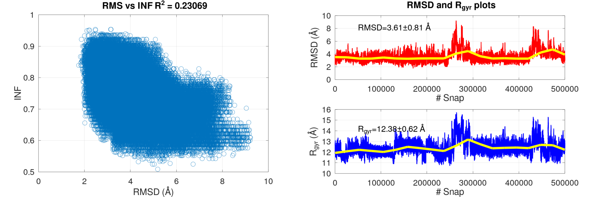
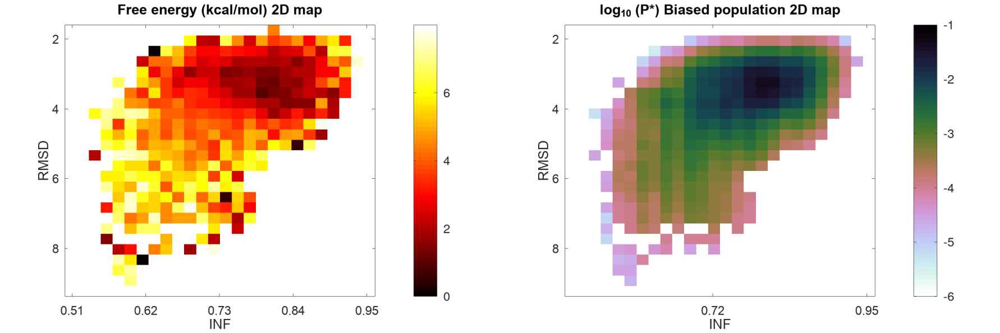
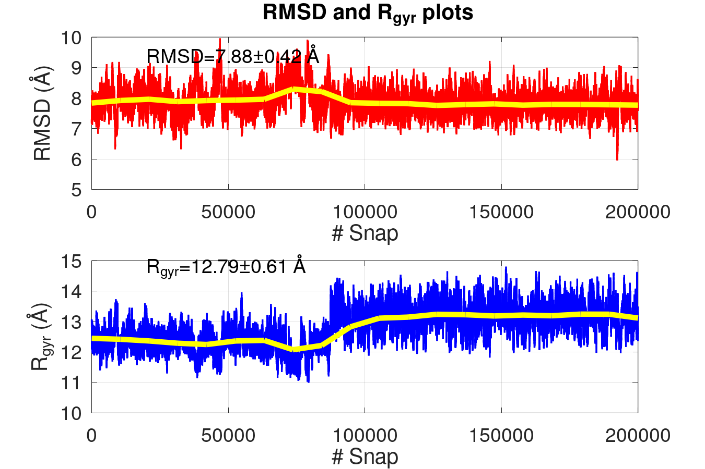
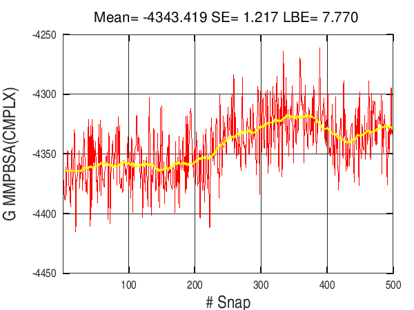
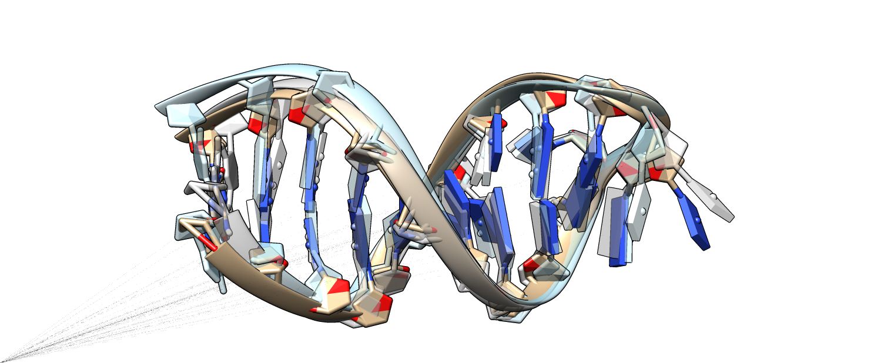

# **APTAMD**

### **Description** 
The application of a computational protocol aimed to refine the 3D structure of aptamer molecules is not straightforward because multiple programs and a large variety of datasets are used. APTAMD is a set of specific scripts that are designed to automate and streamline the most important stages of an MD-based aptamer building protocol that relies on the [AMBER](https://ambermd.org/) suite of programs: (1) building of an initial model starting from a preliminary 3D structure, (2) Gaussian-accelerated MD simulation, (3) structural analysis and construction of a free energy map, (4) conventional MD simulation, and (5) clustering and energy scoring of the MD trajectory of the aptamer. 


 
The computational protocol implemented in APTAMD is described in detail in the following references:

* A. Díaz-Fernández, R. Miranda-Castro, N. Díaz, D. Suárez, N. de-los-Santos-Álvarez and M.J. Lobo-Castañón. (2020). Aptamers targeting protein-specific glycosylation in tumor biomarkers: general selection, characterization and structural modeling. Chemical Science 11, 9402-9413. [DOI](https://doi.org/10.1039/D0SC00209G )

* A. Díaz-Fernández, C. S. Ciudad, N. Díaz, D. Suárez, N. de-los-Santos-Álvarez and M.J. Lobo-Castañón. (2024). Refinement and Truncation of DNA Aptamers based on Molecular Dynamics Simulations: Computational Protocol and Experimental Validation. *Submitted*
 
All questions regarding the usage of APTAMD or bug reports should be addressed to Dimas Suárez (dimas@uniovi.es).

### **Installation**

The suite is distributed as collection of scripts for Linux systems. Most of the scripts are written in [BASH](https://www.gnu.org/software/bash/) altough some numerical and plotting tasks are performed using Octave or Python scripts. There are also a few Fortran codes that carry out auxiliary tasks. In a few months, we will replace all the Fortran and Octave codes by Python scripts, but the BASH backbone will be maintained.    

To install APTAMD, download the suite with the commands:

`git clone https://github.com/dimassuarez/APTAMD.git`
   
Define the `APTAMD` environmental variable pointing to the directory containing the ATPAMD files:

`export APTAMD=/mydir/APTAMD` 

Compile the auxiliary Fortran codes: 

`cd $APTAMD/AUXTOOLS; ./comp.sh all`

Edit the `$ATPAMD/ENV/aptamd_env.sh` file and adjust the BASH variables pointing to the software tools used by APTAMD (Of course AMBER and other software have to be installed on your system). 

Add `$ATPAMD/bin` to your `$PATH` environment variable:

`export PATH=$APTAMD/bin:$PATH`

Entering at the command line the name(s) of the APTAMD scripts (e.g., `do_aptamer_edition`) should print out a brief description of their functions. 

**CONTENTS**

The APTAMD collection is organized in the following subdirectories:

* EDITION           : Scripts to prepare coordinate and parameter files 
* RUNMD             : Scripts and files to perform GaMD and MD simulations 
* STRUCT            : Scripts to extract MD frames and/or carry out structural analysis and clustering  
* RWGAMD            : Scripts and files to carry out the energy reweighing of the GaMD trajectories
* MMPBSA            : Scripts to perform MMPBSA-like calculations
* AUXTOOLS          : Scripts and auxiliary Fortran codes.
* ENV               : aptamd_env.sh is located here
* bin               : Links to the main BASH scripts
* DOC               : ASCII text files providing help info and details of the computational protocol

**DEPENDENCIES**

* Compiler and Script Interpreters: Octave (version >= 5) , Python3, GNU Parallel Bash, GNU GFortran
* AMBER Suite
* X3DNA-DSSR
* MSMS 

Note: The MMPBSA scripts can handle QM/MM calculations using various QM codes (see comments in [aptamd_env.sh](ENV/aptamd_env.sh) ). 

### **Hardware and OS requirements**
The recommended starting configuration for a workstation or a computer server dedicated to perform molecular simulations of systems with the typical size of aptamers, would include a dual socket motherboard equipped with 2 multicore CPUs, 4 GB of RAM per CPU core and a storage capacity greater than 4 TB constituted by SSD/NVMe drives. The same computer should be equipped with at least two state-of-the-art NVIDIA GPU cards. Assuming that a Linux operating system (e.g. [Almalinux](https://almalinux.org/)) and the AMBER package are installed, such a workstation/server machine would be able to simultaneously carry out production runs on the GPUs with minimum CPU usage and other tasks for the preparation and analysis of the GaMD/MD trajectories using the remaining RAM and CPU cores. Further information pertaining to the recommended hardware can be found on the AMBER website [GPU info](https://ambermd.org/GPUHardware.php). All major HPC hardware vendors offer workstations and clusters suitable for performing MD simulations.

---


## **User Guide**

### Initial model: `do_aptamer_edition` 
For a given aptamer sequence, its secondary (2D) structure can be predicted using the [mfold](http://www.unafold.org/DNA_form.php) algorithm. From the 2D mfold structure, initial 3D coordinates in PDB format can be obtained using the [RNA Composer webserver](https://rnacomposer.cs.put.poznan.pl/). The preliminary 3D models are processed automatically using `do_aptamer_edition.sh` that executes and monitors other scripts and programs of the [AMBER suite](https://ambermd.org/). `do_aptamer_edition.sh` transforms the atom and residue names of RNA to those of DNA, removes all 2’-hydroxyl groups on the ribose sugars, adds the missing methylene in thymines and all the H atoms, and assigns the required Molecular Mechanics (MM) parameters from the [parmbsc1 force field](https://mmb.irbbarcelona.org/www/ParmBSC1),  relaxes the internal geometry of the nucleobases and adds an octahedral box  water molecules including and Na+/Cl- counterions. 


---

**EXAMPLE**
In this example, we build a *denovo* model for the unbound form of the 22-mer aptamer CGACCAACGTGTCGCCTGGTCG. The [1DB6](https://www.rcsb.org/structure/1db6) structure in the PDB contains several NMR models of the complexed form. 

Select or make a working directory that will contain the main directory of the simulation to be done. Use then the following commands:

`cd` *Working Directory*

`mkdir 1DB6_model_GAMD; cd 1DB6_model_GAMD; mkdir 1.EDITION; cd 1.EDITION`
`cp $APTAMD/EXAMPLE_INPUT_FILES/1DB6_model_initial.pdb .`

where `1DB6_model_initial.pdb` is the PDB file with the initial coordinates generated by RNA composer using the 2D mfold structure (we're not using the PDB data here!)

Assuming that `$APTAMD/bin` is in your PATH, the MM parameter files are obtained with:

`do_aptamer_edition  1DB6_model_initial.pdb`

what generates multiple files:

```
1DB6_model_initial.pdb  1DB6_model_solute.pdb   edit_leap_solute.src     sander_relax_solute. 
1DB6_model.pdb          1DB6_model_solute.top  edit_leap.log         edit_leap.src
1DB6_model.crd  1DB6_model_solute.crd   1DB6_model.top , ....
```

For example, `1DB6_model.top` and `1DB6_model.crd` are the topology (parameter) and intial coordinate files of the solvated aptamer ready to be used in the subsequent GaMD simulation.


### Gaussian Accelerated MD simulation : `do_runmd` 
The conformational space of the solvated aptamer is explored by means of a Gaussian Accelerated Molecular Dynamics (GaMD) simulation{Miao, 2015 #28} or by conventional MD simulations. GaMD uses harmonic boost potentialsto smooth out the potential energy surface, accelerating thus transitions between low-energy configurations. `do_runmd.sh` controls various preparatory stages (solvent relaxation, thermalization, pressurization and GaMD equilibration) and finally launches the production phase of the GaMD/MD simulations. The settings of the GaMD and MD calculations driven by do_runmd.sh are normally employed in many biomolecular simulations. See [here](SUITE_APTAMD/DOC/MD_settings.txt) for further details.  

---
**EXAMPLE**

To launch the GaMD simulation of the 1DB6 model

`cd` *Working directory*    

`cp $APTAMD/EXAMPLE_INPUT_FILES/input_rungamd.src  1DB6_model_GAMD/`

The basic options for this GaMD job are described in the [input_rungamd.src file](EXAMPLE_INPUT_FILES/input_rungamd.src). Then we run the joB: 

`do_runmd  1DB6_model_GAMD/input_rungamd.src`

*WARNING* 1-2 days of GPU usage and multicore CPU are required to run the GAMD simulation.  

`do_runmd` makes new subdirectories into the project directory (i.e. 1DB6_model_GAMD) and writes many input and output files. Most importantly, the `5.PRODUCTION` folder contains the trajectory files named as md_001.* , md_002.* etc. For example, 

```
gamd_eq.mdcrd    ---> GaMD equilibration coordinates
gamd_eq.out      ---> GaMD equilibiration output
gamd.log
gamd-restart.dat
gamd.rst
job_GAMD.sh
md_000.rst      ---> Starting point of the production phase = gamd.rst 
md_001.gamd_log ---> Log file with GaMD boost potential data
md_001.out      ---> PMEMD output files 
md_001.rst      ---> PMEMD restart file
md_001_solute.mdcrd     ---> Coordinates of the solute atoms along the simulation  
md_001_solutewat.mdcrd  ---> Coordinates of solute, counterions and a shell of waters 
md_002.gamd_log
md_002.out
md_002.rst
md_002_solute.mdcrd
md_002_solutewat.mdcrd
...
````

The folders 2.RELAX_SOLVENT, 3.THERMALIZATION and 4.PRESSURIZATION contain the intermediate files produced during the preparatory stages of the GaMD simulation.  

*Hint:* If necessary the GaMD simulation can be resumed by changing & executing the `job_GaMD.sh` script in 5.PRODUCTION.


### Analysis of GaMD trajectories: `do_struct`  and `do_reweight_gamd`
The GaMD conformations can be characterized by two structural indexes: 

* the root-mean-squared-deviation (RMSD) of the heavy atoms (P, C, N, O) with respect to the initial structure.
* the interaction network fidelity index (INF), which is built from the sets of characteristic intramolecular interactions in a reference structure ($S_r$) and in a given snapshot ($S_m$) (See [Parisien et. al.](https://doi.org/10.1261%2Frna.1700409)). The values of $S_r$ and $S_m$, are determined by the [DSSR](https://x3dna.org/) software, which identifies both base pair interactions and non-pair interactions (i.e., base stacking or base contacts).

A single script `do_struct.sh`  processes all the GaMD trajectory files, evaluates these and other structural descriptors using  the cpptraj and DSSR programs, calculates the statistical average and standard deviations of the RMSD/INF data and shows graphically their evolution along the GaMD trajectory.

---

**EXAMPLE**
To obtain the RMSD plot , the RGYR plot (radius of gyration) and the INF plots of the aptamer during the GaMD simulation:

`cd` *Working directory*    

`cp $APTAMD/EXAMPLE_INPUT_FILES/input_struct.src  1DB6_model_GAMD/`

`do_struct  1DB6_model_GAMD/input_struct.src`

**WARNING** The DSSR program, which is needed to calculate the DNA structural descriptors, demands much CPU time. 

Some  options for `do_struct`are specified in [input_struct.src](EXAMPLE_INPUT_FILES/input_struct.src) and the output is written in a new folder 6.ANALYSIS/STRUCT. The evolution of the RMSD/RGYR/INF descriptors is plotted along the GaMD trajectory (see the .png files). 



---

The GaMD simulation is energetically reweighed in terms of the RMSD/INF coordinates to produce a 2D free energy map of the conformational space. The `do_reweight_gamd.sh`script  assembles all the necessary data files, selects a proper number of bins along the RMSD/INF coordinates and plots the free energy ($G$) and the logarithm of the unweighted population ($\log_{10}(P^*)$) distributions over the 2D bins.  `do_reweight_gamd.sh` also selects a set of representative structures from the GaMD trajectory files and saves them in PDB format . 

---

**EXAMPLE**

Processing of the GaMD trajectory can be done in just one step:

`cd` *Working directory*    

`cp $APTAMD/EXAMPLE_INPUT_FILES/input_rwgamd.src  1DB6_model_GAMD/`

`do_reweight_gamd  1DB6_model_GAMD/input_rwgamd.src`

The output from `do_reweight_gamd` is saved into 6.ANALYSIS/RW_GAMD_ENE. It is normal to try different settings for reweighing (e.g., bin size or descriptors) so that `do_reweight_gamd` creates specific directories (see also an example of [input_rwgamd.src](EXAMPLE_INPUT_FILES/input_rwgamd.src)). Again many output files are produced, but 2D_RW.dat deserves particular attention because it identifies the most-likely GaMD structures using a syntax as:  
```
Picking up snapshots bin= 5 for  E= 0.946000 POP= 0.035  X=  0.79  Y=  3.54 
   Snapshot 1   isnap= 412857   ID=412857  RC1= 0.793575 RC2= 3.569700 Boost= 2.207924 
   bin= 5  isnap_in_crd= 12857  CRD_FILE= 21 
   ... 
```



In the example, snapshot # 412857 assigned to bin #5 (located on the free energy minimum) corresponds to snapshot #12857 in the MD trajectory segment #21. It has a low value of GaMD boost potential and could be selected for subsequent cMD jobs. The coordinates are saved in a separate PDB file named as snap_5_12857.pdb. 


###  Equilibrium properties of aptamer modelos from conventional MD: `do_cluster` and `do_mmpbsa` 

Conventional MD simulation (cMD) provide (valuable) equilibrium conformational sampling of aptamer models. After the most likely conformer(s) generated by  GaMD  is processed by `do_aptamer_edition.sh`. use again `do_runmd.sh`to drive a cMD simulation that usually extends up to several  µs   to ensure that the aptamer molecule relaxes and explores its equilibrium conformations in aqueous solution. 

---

**EXAMPLE**
To start a cMD from a proper GaMD structure, it is necessary to make a new "main directory" and repeat the preparatory steps like:

cd` *Working Directory*

`mkdir 1DB6_model_MD; cd 1DB6_model_MD; mkdir 1.EDITION; cd 1.EDITION`
`cp selected_file.pdb 1DB6_model_initial.pdb `

where *selected file.pdb* would be your selected GaMD structure (only solute atoms).  A new edition step is then executed to build the topology files and the corresponding solvent box:

`do_aptamer_edition  1DB6_model_initial.pdb`

The conventional MD can be launched with:

`cd` *Working directory*    

`cp $APTAMD/EXAMPLE_INPUT_FILES/input_runmd.src  1DB6_model_MD/`

`do_runmd  1DB6_model_MD/input_md.src`

The variable TYPE in [input_md.src](EXAMPLE_INPUT_FILES/input_md.src) is now declared as TYPE=MD.  

*WARNING* 1-2 days of GPU usage and multicore CPU are required to run the MD simulation.  

---

Using `do_struct.sh` and `do_mmpbsa.sh` the evolution of structural and/or energetic properties are monitored along the cMD simulation. Eventually, these descriptors may exhibit pronounced drifts at the beginning of the cMD  and, therefore,  equilibrium properties and clustering analysis would be better evaluated using only the  “fully-relaxed” part of the trajectory.

---

**EXAMPLE**
Once that the cMD is completed, you can use (and adapt) the following script input files for analysis :  

`cd` *Working directory*    

`cp $APTAMD/EXAMPLE_INPUT_FILES/input_struct_md.src  1DB6_model_MD/`

`cp $APTAMD/EXAMPLE_INPUT_FILES/input_snap.src       1DB6_model_MD/`

`cp $APTAMD/EXAMPLE_INPUT_FILES/input_mmpbsa.src     1DB6_model_MD/`

The RMSD and RGYR values are calculated, but we skip now the INF ones (see for example [input_struct_md.src](EXAMPLE_INPUT_FILES/input_struct_md.src) ). 

`do_struct 1DB6_model_MD/input_struct_md.src`

Note that the resulting plot suggests a small structural transition during the cMD.



Before carrying out the MM-PBSA calculations, MD snapshots are to be extracted from the trajectory files using the `do_snapshots`script and saved in PDB format. 

`do_snapshots 1DB6_model_MD/input_snap.src`

The PDB files for the snapshots are saved in `6.ANALYSIS/SNAPSHOTS`. In the same directory, other files contain data characterizing the Na+···APT contacts that can be of particular interest for aptamer simulations.  

Next `do_mmpbsa.sh` takes coordinates from the snapshot PDBs to calculate MM-PBSA like energies (many options can be selected, see [do_mmpbsa.txt](DOC/do_mmpbsa.txt). 

`do_mmpbsa 1DB6_model_MD/input_mmpbsa.src`

SANDER/PBSA output files (packed into a `OUTPUT.tar` file) and many other files with parsed data are saved in the 6.ANALYSIS/MMPBSA directory. Since different inner dielectric constants can be used (default is PDIE=1), the MMPBSA files are actually written in subdirectories named as PDIE_1, PDIE_4, etc.  The '.dat' files contain the data calculated for each MD snapshot while those files with the `.med` extension contain the mean values and statistical uncertainties (see the example below).  Statistics can be redone for a particular segment of trajectory using the $APTAMD/MMPBSA/stat_plot.sh script. See the following G_MMPBSA.med example:

```
# PREFIX G_MMPBSA(CMPLX) USING BOTTOM -50% RESULTING IN NDAT= 250
 Mean       -4328.206  
 Max        -4261.070  
 Min        -4383.853  
 SE             1.414  
 BE             0.000  
 LBE            2.527  
# SE: standard error 
# BE: block error estimate (non-linear fitting)
#LBE: limiting block error estimate 

```
The corresponding `.png` files display the time evolution of the various energy components.  For example,   



--- 

#### About MM-PBSA

Many variants of the [MM-PBSA](https://pubs.acs.org/doi/abs/10.1021/acs.jcim.8b00805) approach are routinely applied in a broad range of biomolecular modeling applications and there exist several tools for streamlining this type of calculations on MD ensembles. In particular, the scoring of the aptamer models is readily available by computing the conventional MM-PBSA energy of the solute atoms as:

$$ G = E_{MM} + \Delta G_{solv}^{PB} +  \Delta G_{solv} ^{np} $$

where  $E_{MM}$ is the molecular mechanics energy including the 3RT contribution due to six translational and rotational degrees of freedom, $ \Delta G_{solv}^{PB} $  is the electrostatic solvation energy obtained from Poisson-Boltzmann calculations,and $\Delta G_{solv} ^{np}$  is the non-polar part of solvation energy due to cavity formation and dispersion interactions between the solute and the solvent molecules.

---

#### Clustering

Clustering analysis of the cMD trajectory can yield critical information to optimize the sequence of the aptamer. This task can be performed using the average-linkage clustering algorithm as implemented in the [cpptraj](https://amberhub.chpc.utah.edu/cpptraj/) program. Our script  `do_cluster.sh` organizes all the input/output data files and assigns optimal values to the clustering options. The distance metric between MD frames is calculated via best-fit coordinate RMSD using the coordinates of the heavy atoms (C, N, O, P). To select a proper RMSD threshold, it is useful to test several values around 1-5 Å and choose the threshold that gives a small number of populated clusters.

---

**EXAMPLE**


`cd` *Working directory*    

`cp $APTAMD/EXAMPLE_INPUT_FILES/input_cluster.src  1DB6_model_MD/`

`do_cluster  1DB6_model_MD/input_cluster.src`

The variable EPS in [input_cluster.src](EXAMPLE_INPUT_FILES/input_cluster.src) is declared as an array (EPS="1.0 1.5 2.0") so that three different thresholds are considered. Note also that only the last 50% of the cMD frames is considered for clustering. The aptamer model turns out to be quite rigid (very rigid indeed) and a low value of EPS=1.5 is appropriate to yield a few populated clusters (see the summary.dat file). The cluster representatives in PDB format can be readily visualized using molecular graphics software such as Pymol or Chimera.  



### Other script tools in APTAMD

The APTAMD suite includes scripts for MM parameterization,  system preparation and edition, entropy calculations, Autodock calculations on multiple MD frames of receptors and ligands, etc. These and other scripts will be uploaded to GitHub (and documented) in the near future. 

